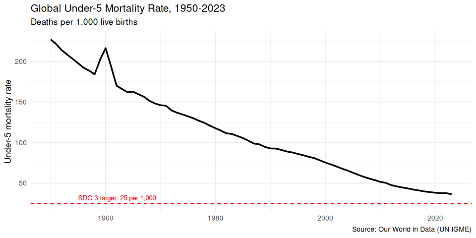
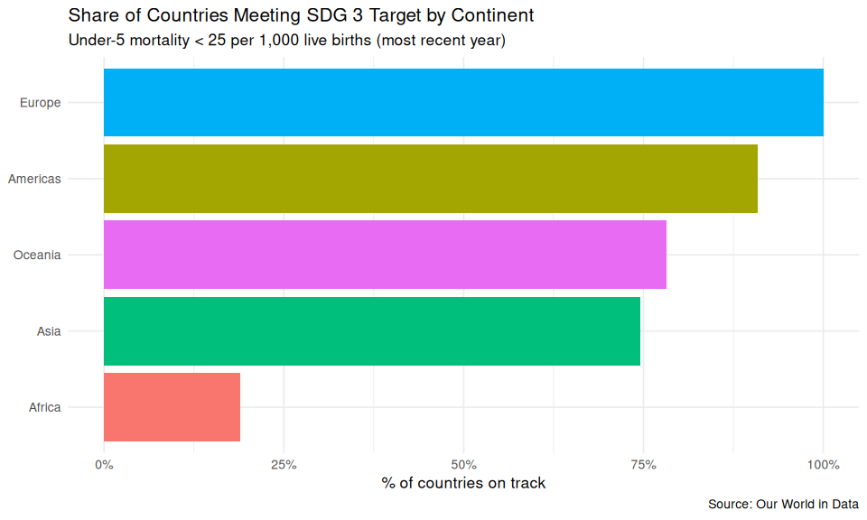
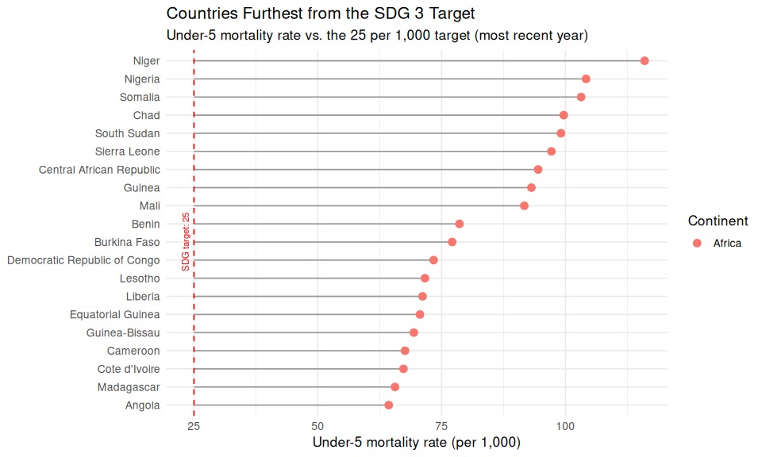
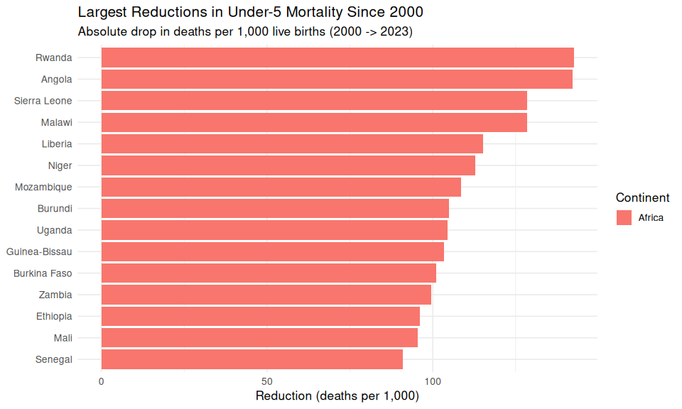
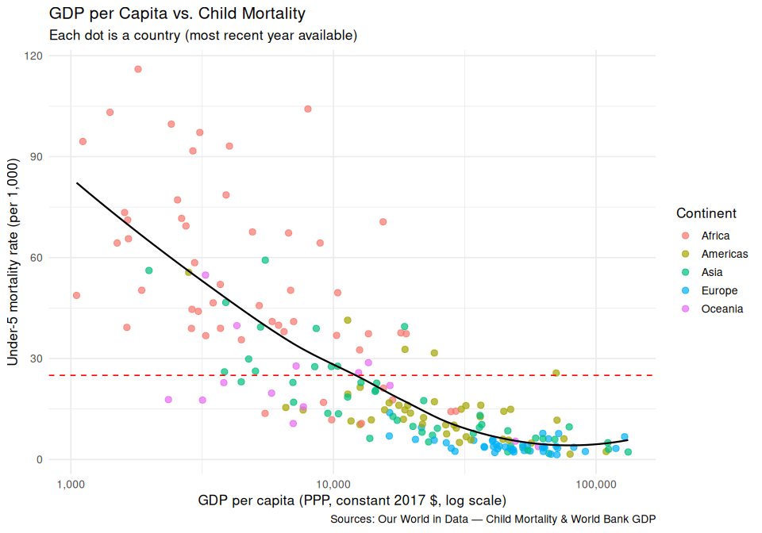

Global Child Mortality & SDG 3 Progress
================
Alvaro de Diego
2026-07-05

- [Introduction](#introduction)
- [Data Sources](#data-sources)
- [Setup](#setup)
- [Data Preparation](#data-preparation)
  - [Loading and exploring the data](#loading-and-exploring-the-data)
  - [Renaming](#renaming)
  - [Handling missing codes](#handling-missing-codes)
  - [Separating countries from
    aggregates](#separating-countries-from-aggregates)
  - [Adding continent](#adding-continent)
- [Exploratory Data Analysis](#exploratory-data-analysis)
  - [Question 1: How has global child mortality changed over
    time?](#question-1-how-has-global-child-mortality-changed-over-time)
  - [Question 2: Which regions are on/off track for the SDG
    target?](#question-2-which-regions-are-onoff-track-for-the-sdg-target)
  - [Question 3: Which countries reduced mortality the most since
    2000?](#question-3-which-countries-reduced-mortality-the-most-since-2000)
  - [Question 4: Does GDP per capita predict child
    mortality?](#question-4-does-gdp-per-capita-predict-child-mortality)
- [Key Findings](#key-findings)

## Introduction

Every year, millions of children die before their fifth birthday from
causes that are largely preventable — infections, malnutrition, lack of
access to basic healthcare. **SDG 3 — Good Health and Wellbeing**, one
of the United Nations’ 17 Sustainable Development Goals, sets a clear
target: reduce under-5 mortality to below **25 per 1,000 live births**
by 2030.

This project analyzes how the world is progressing toward that goal.
Using country-level data spanning over 70 years, we look at the global
trend, identify which regions and countries are on or off track, explore
where the biggest improvements happened, and examine the relationship
between national wealth and child survival.

**Questions explored:**

1.  How has global child mortality changed over time?
2.  Which regions are on/off track for the SDG 3 target?
3.  Which countries reduced mortality the most since 2000?
4.  Does GDP per capita predict child mortality?

------------------------------------------------------------------------

## Data Sources

This analysis uses two open datasets from [Our World in
Data](https://ourworldindata.org), a research project based at the
University of Oxford that provides free, open-access data on global
development issues.

- **Child Mortality**
  ([source](https://ourworldindata.org/child-mortality)) — Under-5
  mortality rate by country and year, based on estimates from the UN
  Inter-agency Group for Child Mortality Estimation (UN IGME). The
  dataset contains 18,722 rows covering 253 entities (countries and
  regions) from 1950 to 2023. The mortality rate is expressed as a
  percentage (per 100 live births).

- **GDP per capita**
  ([source](https://ourworldindata.org/grapher/gdp-per-capita-worldbank))
  — GDP per capita in PPP (purchasing power parity), adjusted to
  constant 2017 international dollars, from the World Bank. This allows
  fair comparison between countries by accounting for differences in
  cost of living.

Both datasets are well-maintained, regularly updated, and widely used in
academic research and policy analysis.

------------------------------------------------------------------------

## Setup

``` r
library(tidyverse)
library(scales)
library(countrycode)
```

------------------------------------------------------------------------

## Data Preparation

### Loading and exploring the data

``` r
mortality_raw <- read_csv("datasets/child-mortality-around-the-world.csv")
glimpse(mortality_raw)
```

    ## Rows: 18,722
    ## Columns: 4
    ## $ Entity                 <chr> "Afghanistan", "Afghanistan", "Afghanistan", "A…
    ## $ Code                   <chr> "AFG", "AFG", "AFG", "AFG", "AFG", "AFG", "AFG"…
    ## $ Year                   <dbl> 1950, 1951, 1952, 1953, 1954, 1955, 1956, 1957,…
    ## $ `Child mortality rate` <dbl> 41.3701, 40.7994, 40.2240, 39.6423, 39.1589, 38…

``` r
head(mortality_raw)
```

    ## # A tibble: 6 × 4
    ##   Entity      Code   Year `Child mortality rate`
    ##   <chr>       <chr> <dbl>                  <dbl>
    ## 1 Afghanistan AFG    1950                   41.4
    ## 2 Afghanistan AFG    1951                   40.8
    ## 3 Afghanistan AFG    1952                   40.2
    ## 4 Afghanistan AFG    1953                   39.6
    ## 5 Afghanistan AFG    1954                   39.2
    ## 6 Afghanistan AFG    1955                   38.4

``` r
summary(mortality_raw)
```

    ##        Entity             Code            Year      Child mortality rate
    ##  Length   :18722   Length   :18722   Min.   :1950   Min.   : 0.1401     
    ##  N.unique :  253   N.unique :  248   1st Qu.:1968   1st Qu.: 1.7838     
    ##  N.blank  :    0   N.blank  :    0   Median :1986   Median : 4.8143     
    ##  Min.nchar:    4   Min.nchar:    3   Mean   :1986   Mean   : 8.5128     
    ##  Max.nchar:   59   Max.nchar:    8   3rd Qu.:2005   3rd Qu.:12.6143     
    ##                    NAs      :  370   Max.   :2023   Max.   :68.8642

All columns except `Code` have no nulls and show sensible values. `Code`
has 370 rows with null values, which we will investigate below. A few
things to address before analysis:

- **Column names** need to be cleaner — e.g., `Entity` → `country`, and
  `Child mortality rate` should not have spaces.
- **Unit conversion**: the original mortality values are percentages
  (per 100 live births). We need to multiply by 10 to get the standard
  unit used by the UN and SDG targets (per 1,000 live births).
- **Code length**: country codes should all be 3 letters (ISO3). Some
  entities have longer codes, which likely means they are regional
  aggregates rather than countries.

### Renaming

``` r
mortality <- mortality_raw %>%
  rename(
    country  = Entity,
    code     = Code,
    year     = Year,
    u5mr_pct = `Child mortality rate`
  ) %>%
  # Convert from per 100 to per 1,000 live births (the SDG standard).
  mutate(u5mr = u5mr_pct * 10)
```

### Handling missing codes

``` r
mortality %>%
  filter(is.na(code)) %>%
  group_by(country) %>%
  summarise()
```

    ## # A tibble: 5 × 1
    ##   country                                                    
    ##   <chr>                                                      
    ## 1 Least developed countries                                  
    ## 2 Less developed regions                                     
    ## 3 Less developed regions, excluding China                    
    ## 4 Less developed regions, excluding least developed countries
    ## 5 More developed regions

The 370 missing-code rows all belong to broad regional aggregates (e.g.,
“Least developed countries”, “More developed regions”). These won’t be
used in the country-level analysis, so we remove them.

``` r
mortality <- mortality %>%
  filter(!is.na(code))
```

### Separating countries from aggregates

Some remaining entities have codes longer than 3 characters — let’s see
which ones:

``` r
mortality %>%
  filter(nchar(code) > 3) %>%
  distinct(country, code)
```

    ## # A tibble: 12 × 2
    ##    country                              code    
    ##    <chr>                                <chr>   
    ##  1 Africa (UN)                          UN_AFR  
    ##  2 Asia (UN)                            UN_ASI  
    ##  3 Europe (UN)                          UN_EUR  
    ##  4 High-income countries                OWID_HIC
    ##  5 Kosovo                               OWID_KOS
    ##  6 Latin America and the Caribbean (UN) UN_LAC  
    ##  7 Low-income countries                 OWID_LIC
    ##  8 Lower-middle-income countries        OWID_LMC
    ##  9 Northern America (UN)                UN_NAM  
    ## 10 Oceania (UN)                         UN_OCE  
    ## 11 Upper-middle-income countries        OWID_UMC
    ## 12 World                                OWID_WRL

All are regional groupings (e.g., `OWID_WRL` for “World”, `UN_AFR` for
“Africa”) except Kosovo, which is a partially recognized country without
a standard ISO3 code. We use the `countrycode` package to keep only rows
with valid ISO3 country codes, and store the “World” aggregate
separately for the global trend plot.

``` r
countries <- mortality %>%
  filter(!is.na(countrycode(code, origin = "iso3c",
                            destination = "country.name",
                            warn = FALSE)))

world <- mortality %>%
  filter(country == "World")

cat("Number of countries:", n_distinct(countries$country), "\n")
```

    ## Number of countries: 236

### Adding continent

``` r
countries <- countries %>%
  mutate(
    continent = countrycode(code, origin = "iso3c", destination = "continent")
  )

countries %>%
  count(continent, sort = TRUE)
```

    ## # A tibble: 5 × 2
    ##   continent     n
    ##   <chr>     <int>
    ## 1 Africa     4292
    ## 2 Americas   4070
    ## 3 Asia       3774
    ## 4 Europe     3626
    ## 5 Oceania    1702

The data is clean and ready for analysis. We have 236 countries across 5
continents, with yearly mortality data from 1950 to 2023.

------------------------------------------------------------------------

## Exploratory Data Analysis

### Question 1: How has global child mortality changed over time?

``` r
ggplot(world, aes(x = year, y = u5mr)) +
  geom_line(color = "black", linewidth = 1.2) +
  geom_hline(yintercept = 25, linetype = "dashed", color = "red") +
  annotate("text", x = 1955, y = 32,
           label = "SDG 3 target: 25 per 1,000",
           color = "red", hjust = 0, size = 3.5) +
  labs(
    title = "Global Under-5 Mortality Rate, 1950-2023",
    subtitle = "Deaths per 1,000 live births",
    x = NULL,
    y = "Under-5 mortality rate",
    caption = "Source: Our World in Data (UN IGME)"
  ) +
  theme_minimal(base_size = 13)
```

<!-- -->

> **Interpretation:** The graph shows a clear and continuous decline in
> child mortality over the last 70 years. The global rate went from
> around 225 per 1,000 in 1950 to approximately 37 per 1,000 in 2023 — a
> drop of more than 80%. There is a small local peak visible around
> 1958-1962, which could be linked to the Great Chinese Famine
> (1959-1961), one of the deadliest famines in history, which heavily
> affected child survival in the most populated country in the world at
> the time.
>
> Even though the overall progress is impressive, the SDG 3 target of 25
> per 1,000 has not been reached yet. We are still around 12 points
> above it. What is also concerning is that the slope has been getting
> flatter in recent years, meaning each year we improve a bit less than
> the previous one. This suggests that the “easy gains” have already
> been made and the remaining gap will be harder to close. To keep a
> good pace, we need to identify which countries are pulling the global
> average up and focus efforts there. This is what we explore next.

------------------------------------------------------------------------

### Question 2: Which regions are on/off track for the SDG target?

``` r
# Get the most recent year per country
latest <- countries %>%
  group_by(country) %>%
  slice_max(year, n = 1) %>%
  ungroup()

# Summarize by continent: share of countries below the SDG target
continent_summary <- latest %>%
  group_by(continent) %>%
  summarize(
    n_countries  = n(),
    below_target = sum(u5mr < 25, na.rm = TRUE),
    pct_on_track = below_target / n_countries
  ) %>%
  arrange(desc(pct_on_track))

continent_summary
```

    ## # A tibble: 5 × 4
    ##   continent n_countries below_target pct_on_track
    ##   <chr>           <int>        <int>        <dbl>
    ## 1 Europe             49           49        1    
    ## 2 Americas           55           50        0.909
    ## 3 Oceania            23           18        0.783
    ## 4 Asia               51           38        0.745
    ## 5 Africa             58           11        0.190

``` r
ggplot(continent_summary, aes(x = reorder(continent, pct_on_track),
                               y = pct_on_track, fill = continent)) +
  geom_col(show.legend = FALSE) +
  scale_y_continuous(labels = percent) +
  coord_flip() +
  labs(
    title = "Share of Countries Meeting SDG 3 Target by Continent",
    subtitle = "Under-5 mortality < 25 per 1,000 live births (most recent year)",
    x = NULL,
    y = "% of countries on track",
    caption = "Source: Our World in Data"
  ) +
  theme_minimal(base_size = 13)
```

<!-- -->

> **Interpretation:** The results show a big gap between continents.
> Europe has 100% of its countries meeting the target, and the Americas
> are close at 91%. Oceania and Asia are around 78% and 75%
> respectively. The most critical region is Africa, where only 19% of
> countries (11 out of 58) meet the SDG 3 target.
>
> What is worth noting is that 13 Asian countries and 5 American
> countries still do not meet the target. Africa clearly needs the most
> attention, but these numbers show that the challenge is not limited to
> one continent.
>
> The obvious next question is: which specific countries are the
> furthest from the target?

------------------------------------------------------------------------

#### 2.1 Which countries are furthest from the target?

``` r
# Top 20 countries with highest child mortality (most recent year)
top_20_count_mort_rate <- countries %>%
  group_by(country) %>%
  slice_max(year, n = 1) %>%
  ungroup() %>%
  filter(u5mr >= 25) %>%
  arrange(desc(u5mr)) %>%
  slice_head(n = 20) %>%
  select(continent, country, u5mr, year)

top_20_count_mort_rate
```

    ## # A tibble: 20 × 4
    ##    continent country                       u5mr  year
    ##    <chr>     <chr>                        <dbl> <dbl>
    ##  1 Africa    Niger                        116.   2023
    ##  2 Africa    Nigeria                      104.   2023
    ##  3 Africa    Somalia                      103.   2023
    ##  4 Africa    Chad                          99.7  2023
    ##  5 Africa    South Sudan                   99.1  2023
    ##  6 Africa    Sierra Leone                  97.2  2023
    ##  7 Africa    Central African Republic      94.5  2023
    ##  8 Africa    Guinea                        93.1  2023
    ##  9 Africa    Mali                          91.7  2023
    ## 10 Africa    Benin                         78.6  2023
    ## 11 Africa    Burkina Faso                  77.1  2023
    ## 12 Africa    Democratic Republic of Congo  73.4  2023
    ## 13 Africa    Lesotho                       71.6  2023
    ## 14 Africa    Liberia                       71.2  2023
    ## 15 Africa    Equatorial Guinea             70.6  2023
    ## 16 Africa    Guinea-Bissau                 69.4  2023
    ## 17 Africa    Cameroon                      67.6  2023
    ## 18 Africa    Cote d'Ivoire                 67.3  2023
    ## 19 Africa    Madagascar                    65.6  2023
    ## 20 Africa    Angola                        64.3  2023

``` r
# How many countries are still off track?
off_track <- latest %>%
  filter(u5mr >= 25) %>%
  mutate(gap = u5mr - 25) %>%
  arrange(desc(gap))

cat("Countries still above SDG 3 target:", nrow(off_track), "\n")
```

    ## Countries still above SDG 3 target: 70

``` r
# Lollipop chart showing the gap between each country and the target
off_track %>%
  slice_head(n = 20) %>%
  ggplot(aes(x = reorder(country, gap), y = u5mr)) +
  geom_segment(aes(xend = country, y = 25, yend = u5mr), color = "grey60") +
  geom_point(aes(color = continent), size = 3) +
  geom_hline(yintercept = 25, linetype = "dashed", color = "red") +
  annotate("text", x = 10, y = 24,
         label = "SDG target: 25", color = "red", size = 3,
         angle = 90, vjust = 0) +
  coord_flip() +
  labs(
    title = "Countries Furthest from the SDG 3 Target",
    subtitle = "Under-5 mortality rate vs. the 25 per 1,000 target (most recent year)",
    x = NULL,
    y = "Under-5 mortality rate (per 1,000)",
    color = "Continent"
  ) +
  theme_minimal(base_size = 13)
```

<!-- -->

> **Interpretation:** 70 countries are still above the SDG 3 target, and
> the top 20 are all in Africa. Niger leads with 116 per 1,000 — meaning
> roughly 1 in 9 children die before the age of 5. The gap between these
> countries and the target of 25 is enormous.
>
> Many of the countries on this list share common problems: extreme
> poverty, weak health systems, and in several cases active conflict.
> Niger, Mali, Burkina Faso, and Somalia are all currently dealing with
> armed conflicts or jihadist insurgencies. South Sudan and Chad have
> also faced years of civil war and political instability. These
> situations make it very difficult for international organizations to
> deliver aid and build the health infrastructure needed to reduce child
> mortality.
>
> From a strategic perspective, focusing resources on these top 20
> countries would have the highest impact on the global average, since
> they contribute the most to the overall mortality rate. However, the
> reality of conflict zones means that even with budget, the delivery of
> health services is often blocked. Reaching the SDG 3 target by 2030 in
> these countries seems very unlikely without first achieving a minimum
> level of stability.

------------------------------------------------------------------------

### Question 3: Which countries reduced mortality the most since 2000?

We use 2000 as the starting point because it is when the UN launched the
Millennium Development Goals (MDGs) — the first global framework
specifically targeting child mortality. It allows us to measure progress
during the era of coordinated international health efforts.

``` r
change <- countries %>%
  filter(year %in% c(2000, 2023)) %>%
  select(country, continent, year, u5mr) %>%
  pivot_wider(
    names_from   = year,
    values_from  = u5mr,
    names_prefix = "y"
  ) %>%
  drop_na() %>%
  mutate(
    reduction     = y2000 - y2023,
    pct_reduction = reduction / y2000 * 100
  ) %>%
  arrange(desc(reduction))

change %>% slice_head(n = 15)
```

    ## # A tibble: 15 × 6
    ##    country       continent y2000 y2023 reduction pct_reduction
    ##    <chr>         <chr>     <dbl> <dbl>     <dbl>         <dbl>
    ##  1 Rwanda        Africa     179.  36.8     143.           79.5
    ##  2 Angola        Africa     206.  64.3     142.           68.8
    ##  3 Sierra Leone  Africa     226.  97.2     128.           56.9
    ##  4 Malawi        Africa     168.  39.3     128.           76.6
    ##  5 Liberia       Africa     186.  71.2     115.           61.8
    ##  6 Niger         Africa     229. 116.      113.           49.3
    ##  7 Mozambique    Africa     173.  64.3     108.           62.8
    ##  8 Burundi       Africa     154.  48.8     105.           68.3
    ##  9 Uganda        Africa     143.  38.9     104.           72.8
    ## 10 Guinea-Bissau Africa     173.  69.4     103.           59.8
    ## 11 Burkina Faso  Africa     178.  77.1     101.           56.7
    ## 12 Zambia        Africa     152.  52.0      99.5          65.7
    ## 13 Ethiopia      Africa     141.  44.6      96.2          68.3
    ## 14 Mali          Africa     187.  91.7      95.4          51.0
    ## 15 Senegal       Africa     127.  35.6      91.0          71.9

``` r
change %>%
  slice_head(n = 15) %>%
  ggplot(aes(x = reorder(country, reduction), y = reduction, fill = continent)) +
  geom_col() +
  coord_flip() +
  labs(
    title = "Largest Reductions in Under-5 Mortality Since 2000",
    subtitle = "Absolute drop in deaths per 1,000 live births (2000 -> 2023)",
    x = NULL,
    y = "Reduction (deaths per 1,000)",
    fill = "Continent"
  ) +
  theme_minimal(base_size = 13)
```

<!-- -->

> **Interpretation:** The 15 countries with the biggest absolute
> reductions are all from Africa. This makes sense because these
> countries had the highest mortality rates in 2000 (often above 150 per
> 1,000), so there was more room for improvement. Rwanda leads with a
> drop of 143 per 1,000 — from 179 to 37, a 79.5% decrease.
>
> This is actually a success story. Countries like Rwanda, Malawi,
> Uganda, and Ethiopia made major progress thanks to targeted health
> programs: vaccination campaigns, distribution of bed nets against
> malaria, better access to clean water, and improved prenatal care.
> Many of these initiatives were funded by international organizations
> (UNICEF, WHO, Gates Foundation) as part of the Millennium Development
> Goals.
>
> An important nuance: measuring improvement in absolute terms naturally
> favors countries that started with high values. A country going from
> 200 to 100 shows a bigger reduction (100) than a country going from 30
> to 5 (only 25), even though the second one eliminated most of its
> child mortality. Both achievements are significant — that is why the
> table also includes the percentage reduction, which offers a
> complementary view.

------------------------------------------------------------------------

### Question 4: Does GDP per capita predict child mortality?

``` r
gdp_raw <- read_csv("datasets/gdp-per-capita-worldbank.csv")

gdp <- gdp_raw %>%
  rename(
    country = Entity,
    code    = Code,
    year    = Year,
    gdp_pc  = `GDP per capita`
  )
```

``` r
# Get the most recent GDP value per country and join with mortality data
gdp_latest <- gdp %>%
  group_by(code) %>%
  slice_max(year, n = 1) %>%
  ungroup() %>%
  select(code, gdp_pc, gdp_year = year)

merged <- latest %>%
  left_join(gdp_latest, by = "code") %>%
  drop_na(gdp_pc, u5mr)

cat("Countries with both mortality and GDP data:", nrow(merged), "\n")
```

    ## Countries with both mortality and GDP data: 198

``` r
ggplot(merged, aes(x = gdp_pc, y = u5mr, color = continent)) +
  geom_point(alpha = 0.7, size = 2.5) +
  geom_smooth(method = "loess", color = "black", se = FALSE, linewidth = 0.8) +
  geom_hline(yintercept = 25, linetype = "dashed", color = "red") +
  scale_x_log10(labels = comma) +
  labs(
    title = "GDP per Capita vs. Child Mortality",
    subtitle = "Each dot is a country (most recent year available)",
    x = "GDP per capita (PPP, constant 2017 $, log scale)",
    y = "Under-5 mortality rate (per 1,000)",
    color = "Continent",
    caption = "Sources: Our World in Data — Child Mortality & World Bank GDP"
  ) +
  theme_minimal(base_size = 13)
```

<!-- -->

We can quantify this relationship with a simple log-linear regression,
since the scatter suggests a log-scale pattern:

``` r
model <- lm(u5mr ~ log10(gdp_pc), data = merged)
summary(model)
```

    ## 
    ## Call:
    ## lm(formula = u5mr ~ log10(gdp_pc), data = merged)
    ## 
    ## Residuals:
    ##     Min      1Q  Median      3Q     Max 
    ## -37.824  -8.893  -2.080   4.945  68.815 
    ## 
    ## Coefficients:
    ##               Estimate Std. Error t value Pr(>|t|)    
    ## (Intercept)    184.281      9.156   20.13   <2e-16 ***
    ## log10(gdp_pc)  -38.158      2.163  -17.64   <2e-16 ***
    ## ---
    ## Signif. codes:  0 '***' 0.001 '**' 0.01 '*' 0.05 '.' 0.1 ' ' 1
    ## 
    ## Residual standard error: 15.41 on 196 degrees of freedom
    ## Multiple R-squared:  0.6137, Adjusted R-squared:  0.6117 
    ## F-statistic: 311.4 on 1 and 196 DF,  p-value: < 2.2e-16

The regression uses `log10(gdp_pc)` because, as the scatter plot shows,
the relationship between GDP and mortality is not linear — it follows a
curve with diminishing returns. Taking the log transforms that curve
into a straight line the model can fit. In practical terms, the model
predicts what happens to child mortality each time GDP per capita
multiplies by 10.

> **Interpretation:** The model confirms what the scatter plot suggests:
> there is a strong negative relationship between GDP per capita and
> child mortality (R² = 0.61, p \< 0.001). GDP alone explains about 61%
> of the variation in child mortality across countries.
>
> The coefficient of −38.2 means that each tenfold increase in GDP per
> capita is associated with roughly 38 fewer deaths per 1,000 live
> births. Going from \$1,000 to \$10,000 predicts a drop of ~38 points,
> and going from \$10,000 to \$100,000 predicts the same ~38 — but that
> second jump requires far more wealth for the same reduction. This is
> the “diminishing returns” pattern visible in the chart.
>
> The steepest real-world impact happens between \$1,000 and \$10,000
> GDP per capita. In this range, small increases in wealth allow
> countries to invest in basic health infrastructure: clean water,
> vaccination, trained midwives, and basic hospitals. Above \$10,000,
> the curve flattens — the difference between a \$30,000 and a \$100,000
> country is almost zero in terms of child mortality.
>
> But the remaining 39% not explained by this model matters. The most
> interesting part of the chart is the outliers on the left side. Among
> countries with low GDP (below \$5,000), there is a huge spread: some
> have a mortality rate above 100 per 1,000 while others are below 30.
> GDP alone does not explain everything. Other factors play a major role
> — political stability, quality of governance, presence of conflict,
> and investment in public health. A poor but stable country with good
> health policies can achieve much better child survival than a slightly
> richer country in the middle of a civil war.

------------------------------------------------------------------------

## Key Findings

1.  **Global progress is real but slowing down.** Child mortality
    dropped from ~225 per 1,000 in 1950 to ~37 per 1,000 in 2023 — a
    reduction of more than 80%. However, the rate of improvement has
    slowed in recent years, and the world is still about 12 points above
    the SDG 3 target of 25 per 1,000.

2.  **Africa is the main challenge.** Only 19% of African countries meet
    the SDG target, compared to 100% in Europe and 91% in the Americas.
    The top 20 countries with the highest child mortality are all
    African.

3.  **The biggest improvers are also in Africa.** Rwanda, Angola, and
    Sierra Leone lead with absolute reductions above 125 per 1,000 since
    2000, driven by international health programs and improved access to
    basic care.

4.  **70 countries remain above the SDG target.** Many of them face
    active conflict (Niger, Mali, South Sudan, Somalia), which makes it
    very difficult to improve health outcomes on the ground.

5.  **Wealth helps, but with diminishing returns.** A log-linear model
    shows GDP per capita explains 61% of the variation in child
    mortality, with each tenfold increase in GDP associated with ~38
    fewer deaths per 1,000. But the remaining 39% is driven by
    governance, stability, and health policy — among low-income
    countries, these factors matter as much as income.
